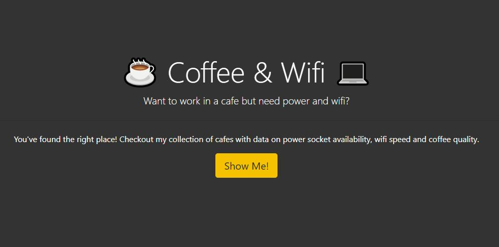
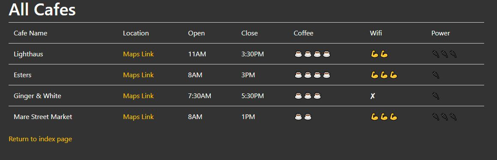
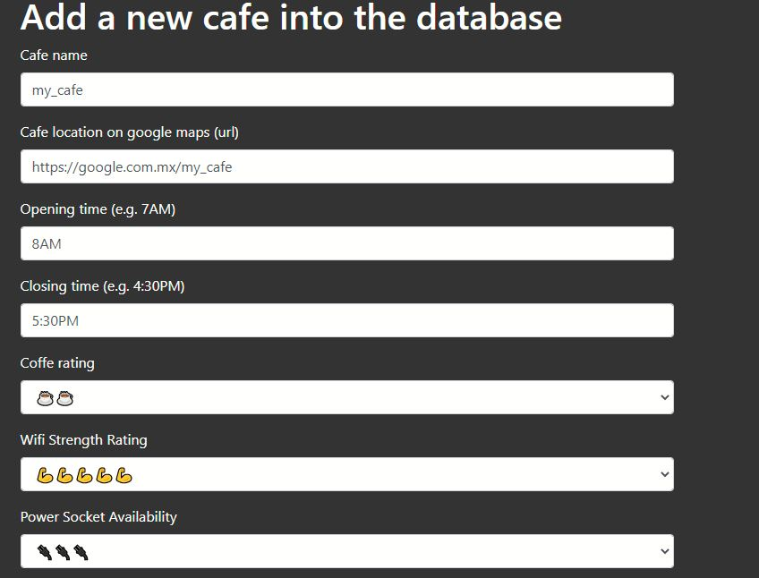
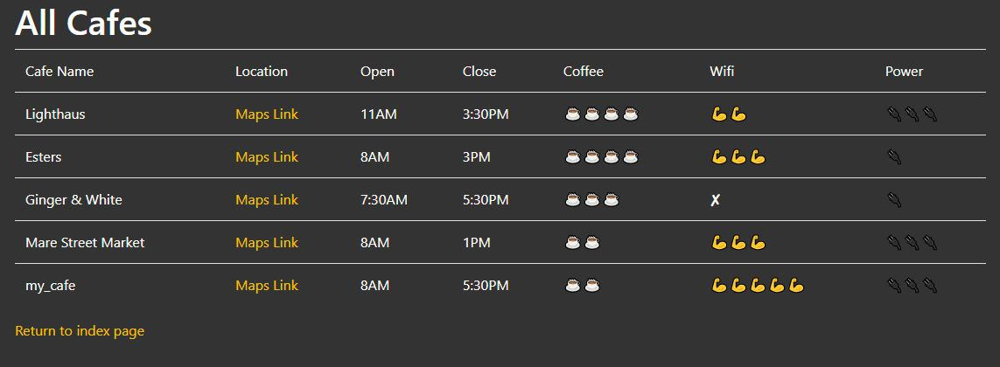

# Coffe & wifi project
Aplicación que me permite ver las cafeterias con datos relevantes de ellas, con la opción de agregar más cafeterias usando como base de datos un csv.

---

Al iniciar la app veremos la página de inicio

---

Sí presionamos "show me!" nos aparecerán las cafeterias y sus datos que ya hemos agregado

---

Podemos agregar más cafeterías poniendo en la barra de navegacion "/add"

---

Una vez que enviamos los datos se nos actualizará automaticamente nuestro catalago.

